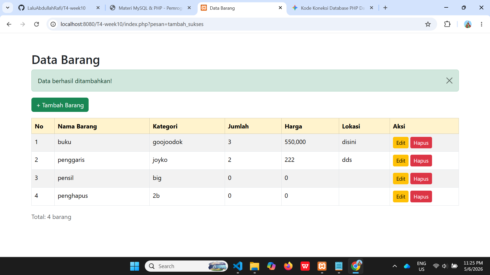
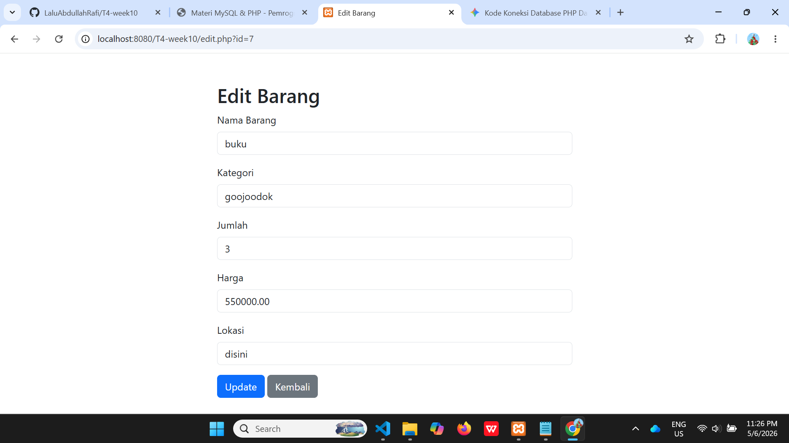
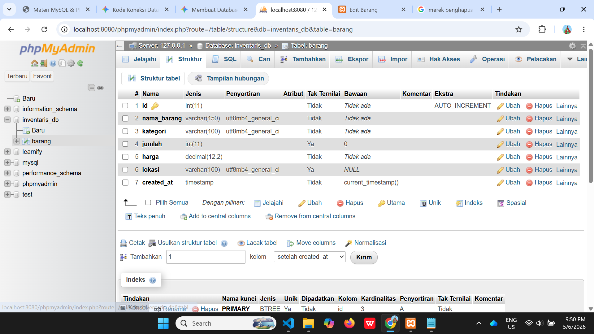

# T4-week10 - Aplikasi CRUD PHP MySQL

Nama  : LALU ABDULLAH RAFI ASYARI
NIM   : F1D02410012
Kelas : Pemrograman Web

## Deskripsi
Aplikasi CRUD (Create, Read, Update, Delete) menggunakan PHP, MySQL, dan Bootstrap.

- Database : inventaris_db
- Tabel    : barang

## Cara Menjalankan
1. Import file `.sql` ke phpMyAdmin.
2. Letakkan folder project di `htdocs/` (XAMPP).
3. Buka browser ke `http://localhost/T4-week10/`.

## Screenshot

### Daftar Data

### Tambah Data

### Edit Data

### Struktur Database (phpMyAdmin)
